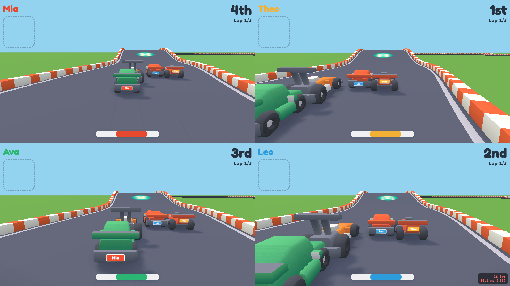

# Tiny Track Party

Multiplayer toy-car racing where phones become tilt controllers and a shared screen is the track.



**▶ [Play it live](https://tinytrack.couch-games.com/)** · **[UI gallery](https://tinytrack.couch-games.com/gallery.html)**

## Overview

Tiny Track Party is a couch party game for 1–4 players on a single shared display. One browser window is the game screen (TV, monitor, or laptop); each player joins by scanning a QR code with their phone and tilts it to steer. Empty seats are topped up with AI ("CPU") racers, so every race runs a full grid. The display runs the authoritative 3D race simulation; the Node.js server only serves static files and a QR code API.

## Architecture

The display browser is authoritative and broadcasts game state to all controllers through a [Party-Sockets](https://github.com/tim4724/Party-Sockets) WebSocket relay. Controller input (`CONTROL` — steer/brake/use, ~25 Hz) rides a lower-latency WebRTC DataChannel fastlane (`partyplug/PartyFastlane.js`, relay-signalled) whenever its channel is open, and falls back to the relay otherwise; all other traffic flows over the relay. Rendering is Three.js.

## Quick Start

```bash
npm install
node server/index.js
```

1. Open `http://localhost:4000` on a big screen.
2. Players scan the QR code with their phones to join.
3. The first player to join is the host and starts the race.
4. Tilt your phone to steer; hold BRAKE to slow down. First across the line wins.

> Phones need HTTPS for the tilt sensors — front the server with a tunnel or TLS cert when testing on real devices.

## Controls

| Input | Action |
|---|---|
| Tilt phone left/right | Steer |
| Hold BRAKE | Slow down |
| Tap USE (when lit) | Fire your power-up |

Cars auto-accelerate; tilt, brake, and the item button are the only inputs. Drive over an item box to roll a power-up — a **boost** (a short speed burst) or a **banana** to drop behind you — which arms the USE button. Boost pads on the track and the rubber-banded item odds give trailing cars a catch-up edge.

## Project Structure

```
server/          # HTTP + static file server (index.js); no game logic
public/
  display/       # Display client: authoritative sim + Three.js renderer
    engine/      #   Game.js — ribbon-follow car simulation (ES module)
  controller/    # Phone tilt controller
  shared/        # protocol.js — wire contract + relay/STUN config
  assets/toycar/ # Kenney Toy Car Kit GLB models
partyplug/       # Reusable party-game transport kit (served under /partyplug/)
vendor/three/    # Vendored Three.js
tests/           # Unit tests (node:test)
```

## Configuration

The relay URL is set in `public/shared/protocol.js`. If you run your own relay, update it there and the CSP `connect-src` directive in `server/index.js`.

| Environment Variable | Default | Description |
|---|---|---|
| `PORT` | `4000` | HTTP server port |
| `BASE_URL` | Auto-detected LAN IP | Base URL for join links and QR codes |
| `APP_ENV` | `development` | Set to `production` for production mode |
| `GIT_SHA` | – | Git commit SHA shown in version endpoint |

## Testing

```bash
npm test  # Unit tests (node:test)
```

Unit tests use Node.js's built-in `node:test` runner — no test framework. They cover the car simulation (`tests/engine.test.js`), track geometry (`tests/track.test.js`), and the partyplug transport kit (`partyplug/tests/`). There is no end-to-end/browser test suite yet; the `/gallery.html` page is a manual no-relay preview surface for catching UI regressions.

## Tech Stack

- **Runtime**: Node.js (static host, no build step)
- **3D**: Three.js (vendored) + Kenney Toy Car Kit assets
- **Relay**: [Party-Sockets](https://github.com/tim4724/Party-Sockets) WebSocket relay (signaling + game events + controller-input fallback)
- **P2P**: WebRTC DataChannels (`partyplug/PartyFastlane.js`) carry low-latency controller input, with automatic WebSocket-relay fallback
- **Frontend**: Vanilla JavaScript + ES modules
- **Production deps**: 1 npm package (`qrcode`)

No build step. No bundler. No framework. Serve and play.
