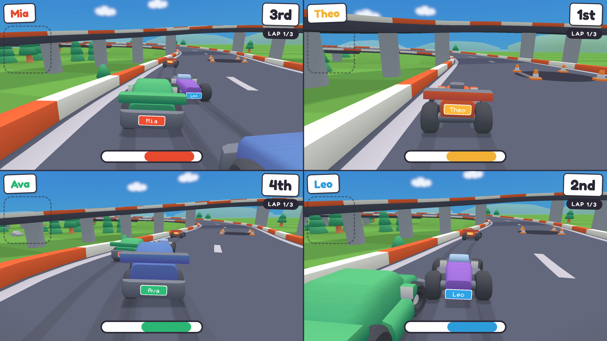

# Tiny Track Party

Multiplayer toy-car racing where phones become tilt controllers and a shared screen is the track.



**▶ [Play it live](https://tinytrack.couchpad.games/)** · **[UI gallery](https://tinytrack.couchpad.games/gallery.html)**

## Overview

A couch party game for 1–4 players on one shared screen — a TV, monitor, or laptop. Players join by scanning a QR code and tilt their phones to steer; empty seats fill with CPU racers, so every race runs a full grid. The display browser is authoritative: it runs the race simulation and drives the renderer. The Node.js server only serves static files and a few JSON endpoints.

## Architecture

**The engine is native.** The car simulation, AI, track builder, party-layer decisions and the 3D renderer are C++ (`native/`), compiled to WebAssembly and loaded by the display page. The renderer is [Filament](https://github.com/google/filament) on WebGL2. There is no JavaScript engine and no fallback — the display awaits the wasm at boot.

That C++ is shared, not web-specific: each platform supplies a thin shell around the same ABIs, which is what makes an Apple TV and Android TV build tractable. The browser is simply the first shell.

JavaScript remains, by design, for the parts that are genuinely per-platform or genuinely browser-only: the HUD and screen rendering, the phone controller, the audio device layer, the authored track descriptors, and the transport I/O.

The display broadcasts game state to every phone through a [Party-Sockets](https://github.com/tim4724/Party-Sockets) WebSocket relay. Steering input rides a lower-latency WebRTC DataChannel (`partyplug/PartyFastlane.js`) when one is open, and falls back to the relay otherwise.

## Quick Start

```bash
npm run setup      # deps + a configured native/build; safe to re-run
npm start          # serves on http://localhost:4000
```

1. Open `http://localhost:4000` on a big screen.
2. Players scan the QR code with their phones to join.
3. The first player to join is the host and starts the race.
4. Tilt to steer, hold BRAKE to slow down. First across the line wins.

> Phones need HTTPS for the tilt sensors — front the server with a tunnel or TLS cert when testing on real devices.

`npm run setup` is the only command a fresh checkout needs, and it reports anything still missing. Rebuilding the engine itself is a separate, heavier step (`native/scripts/build-runtime-web.sh`) that needs a Filament fork and emsdk — the built wasm is checked in, so most work never needs it.

## Controls

| Input | Action |
|---|---|
| Tilt phone left/right | Steer |
| Hold BRAKE | Slow down |
| Tap USE (when lit) | Fire your power-up |

Cars auto-accelerate — tilt, brake, and USE are the only inputs. Drive over an item box to roll a power-up (a **boost** burst, a **banana** to drop behind you, a homing **rocket**, or a catch-up **monster truck**), which arms USE. Boost pads and rubber-banded item odds give trailing cars a catch-up edge.

## Configuration

Set the relay URL in `public/shared/protocol.js` (and the CSP `connect-src` in `server/index.js` if you self-host one). Server env vars:

| Variable | Default | Description |
|---|---|---|
| `PORT` | `4000` | HTTP server port |
| `BASE_URL` | Auto-detected LAN IP | Base URL for join links / QR codes |
| `APP_ENV` | `development` | Set to `production` for production mode |

## Project Structure

```
native/        # The C++ engine: sim, track builder, party layer, UI model,
               # audio decisions, Filament renderer. Compiled to wasm.
public/
  display/     # The browser shell: renders and performs
  controller/  # Phone tilt controller
  shared/      # protocol.js — wire contract, tilt/presence manifest, theme
server/        # Static-file host (no game logic)
partyplug/     # Reusable party-game transport kit
tests/         # Unit, wire-compat and E2E suites; conformance fixtures
```

## Testing

```bash
npm test             # lint + unit tests (node:test)
npm run test:native  # engine conformance suite (ctest)
npm run test:e2e     # Playwright end-to-end, against a local relay stub
```

The engine is checked against recorded traces of the original JavaScript implementation, replayed on every platform, so a port is held to evidence rather than to review. The E2E suite drives the real display and controller pages and needs no production relay — run `npx playwright install chromium` once.

`/gallery.html` is a manual preview surface for UI checks.

## Tech Stack

C++17 compiled to WebAssembly for the engine (the Filament renderer at C++20). Vanilla JavaScript + ES modules for the shells, with no build step and no framework. 3D assets are the Kenney Toy Car Kit. Transport is the [Party-Sockets](https://github.com/tim4724/Party-Sockets) WebSocket relay plus WebRTC DataChannels for low-latency input. No production dependencies: the server is node builtins only.
